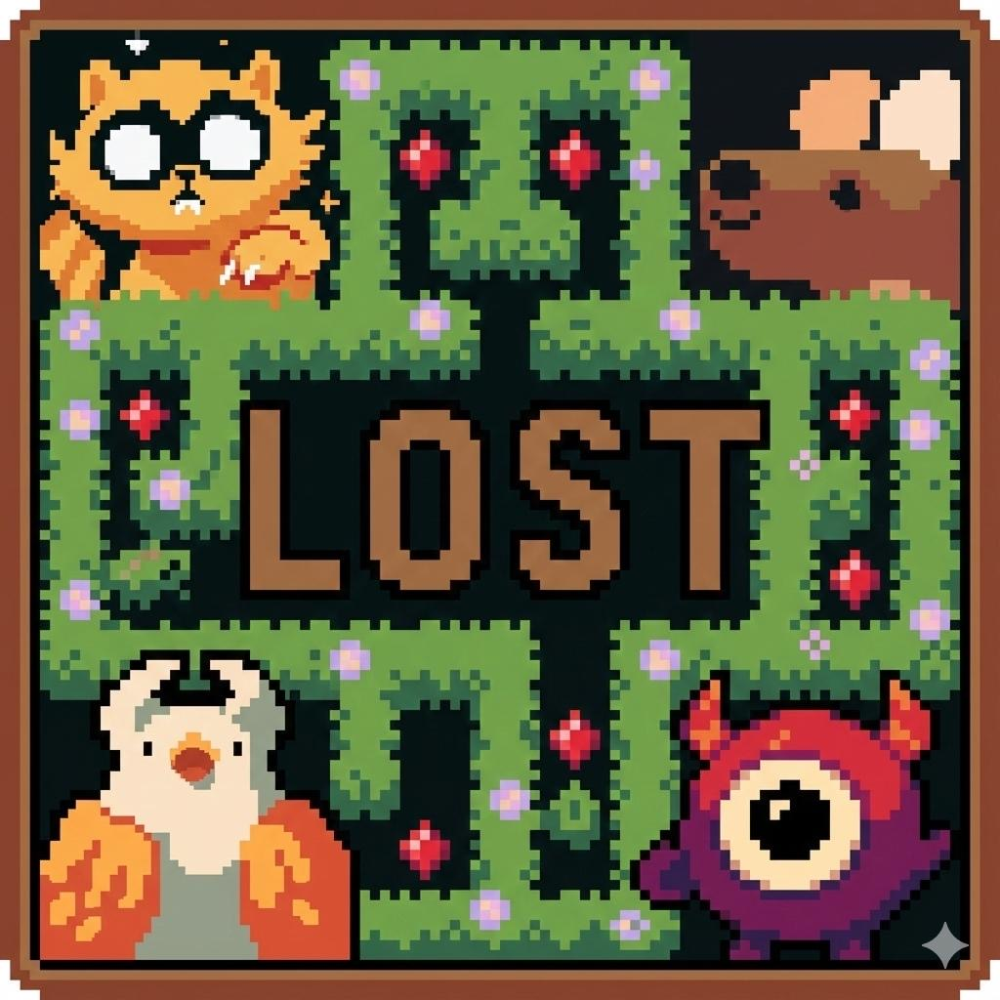
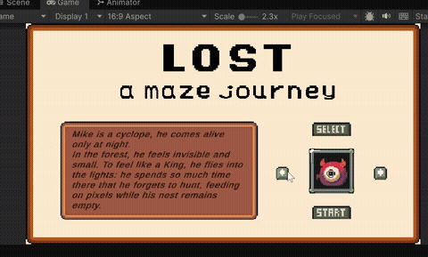

# ehma_SeriousGame_project

<p align="center">
  
  
</p>

Educational serious game built in Unity: the player navigates a **procedurally generated maze**, trying to reach the exit while dealing with "debuffs" that simulate the effects of certain dependencies (drugs, gambling, internet/alcohol addiction) on movement and judgment.

Built with Unity **6000.2.6f2** (Unity 6).

## Game concept

- The player moves through a maze (`Maze.cs`, `Grid.cs`, `GridProbability.cs`) generated with configurable probabilities, looking for portals/exits (`PortalManager.cs`, `PortalTeleporter.cs`, `ExitGateTrigger.cs`).
- A **dependency system** (`Dependency/DependencyManager.cs`, `Dependency/DifficultyManager.cs`) periodically applies debuffs to the player based on the active dependency type (Drugs, Gambling, Internet — modeled as a `[Flags] enum DependencyType`).
- Each debuff temporarily alters movement through a **strategy pattern** (`script player/MovementStrategy/`): e.g. `DrunkStrategy`, `DrunkSluggishStrategy`, `DruggedStrategy`, `DruggedSpinningStrategy`, `GamblerStrategy`, `GamblerRouletteStrategy`, `InternetAddictStrategy`, `InternetPacketLossStrategy`, plus the baseline `NormalMovementStrategy`.
- NPCs with dedicated interactions (`script NPC/` folder): a Sultan (with a "coin toss" mini-game), a samurai, a princess, a pig, an octopus, a boy, a dog, and "bad" NPCs with their own logic.
- Score, health, timer, and minimap management (`Player_Score.cs`, `HealthManager.cs`, `TimerManager.cs`, `Scoremanager.cs`, `MinimapController.cs`).
- End-of-game screen and summary (`Ending/EndSceneManager.cs`, `Ending/EndScreenManager.cs`, `Ending/EndZoneTrigger.cs`).
- Main menu and character selection (`script_Menu/MainMenuManager.cs`, `script_Menu/Character_selection.cs`, `script_Menu/GameUIManager.cs`).

## Project structure

```
ehma_SeriousGame_project/
└── unityProject/
    ├── Assets/
    │   ├── Scripts/              # Game logic (C#)
    │   │   ├── script player/    # Player movement and movement strategies
    │   │   ├── script NPC/       # Non-player character interactions
    │   │   ├── script_Menu/      # Main menu and character selection
    │   │   ├── Dependency/       # Dependency and difficulty system
    │   │   └── Ending/           # End-game screens and events
    │   ├── Scenes/                # SampleScene, MenuScene, EndScene
    │   ├── componenti_gioco/      # Custom sprites and graphical elements (gems, maze pieces)
    │   └── TextMesh Pro/          # Third-party asset for in-game text
    ├── Packages/                  # Unity Package Manager dependencies (see requirements.txt)
    └── ProjectSettings/
```

## Requirements and installation

Detailed requirements (Unity version, UPM packages, modules) are listed in `requirements.txt`.

1. Install **Unity Hub**.
2. Through Unity Hub, install editor version **6000.2.6f2** (or a compatible Unity 6 version).
3. Open Unity Hub → **Add** → select the `unityProject/` folder from this repository.
4. Open the project: Unity will automatically download/resolve the packages listed in `Packages/manifest.json`.
5. Open the `Assets/Scenes/MenuScene.unity` scene and hit Play to start from the main menu, or `SampleScene.unity` to jump straight into the test maze.

## Third-party assets

The project uses the **"Ninja Adventure - Asset Pack"** graphics asset pack (folder `Assets/componenti_gioco/pezzi labirinto/Ninja Adventure - Asset Pack/`) and the **TextMesh Pro** package. Check their respective licenses before publishing or redistributing the project.

## Notes

- The existing `.gitignore` is already set up correctly for Unity (ignores `Library/`, `Temp/`, `Obj/`, `Build/`, `Logs/`, `UserSettings/`, etc.). Only the `.DS_Store` (macOS) line was added, since that file had been tracked by mistake.
