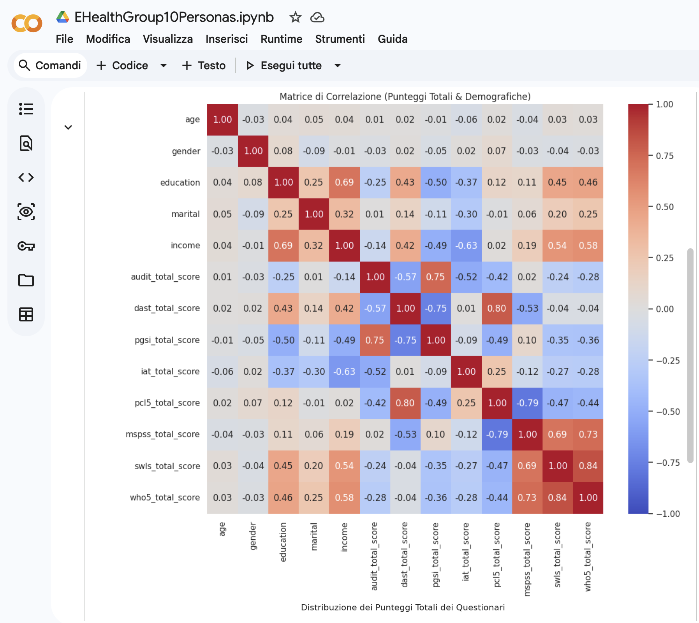
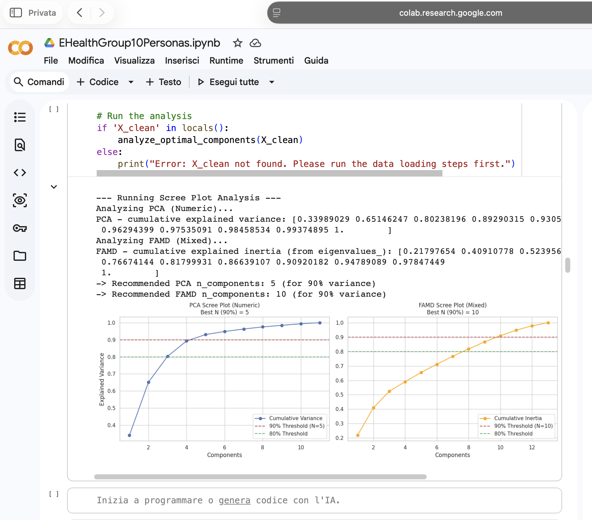
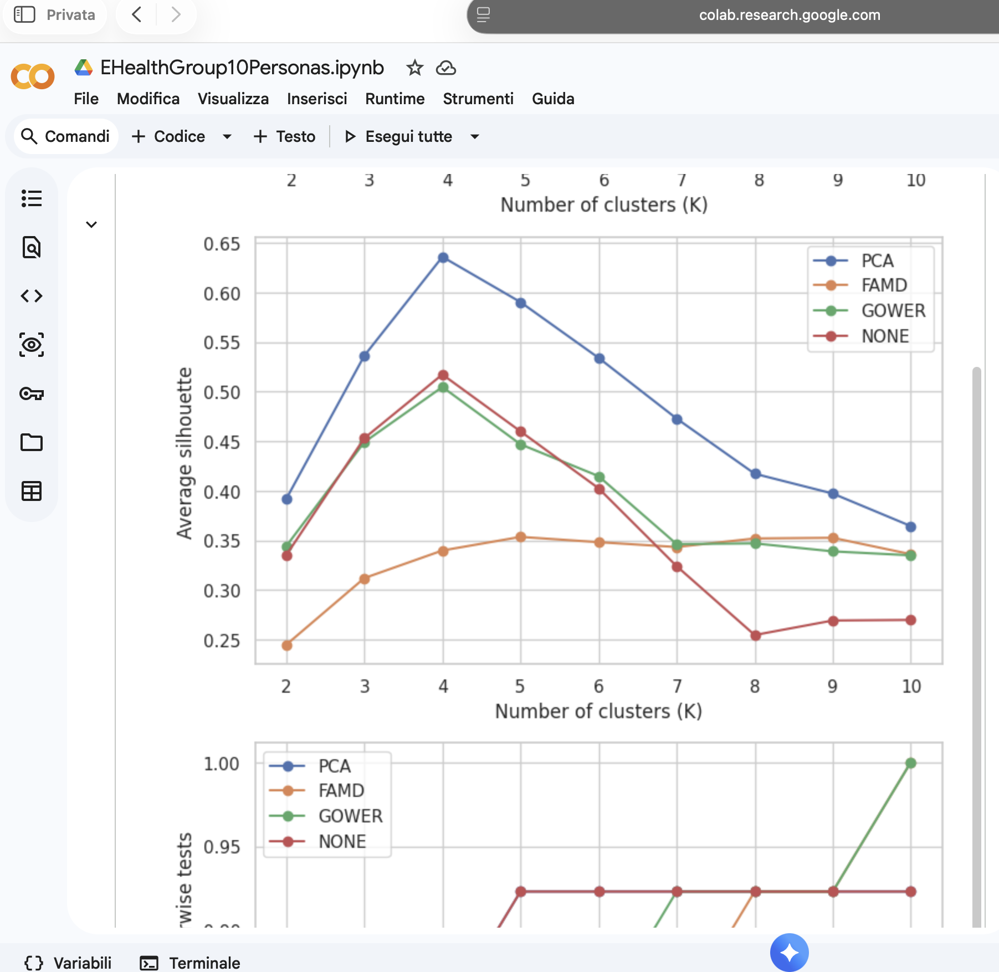
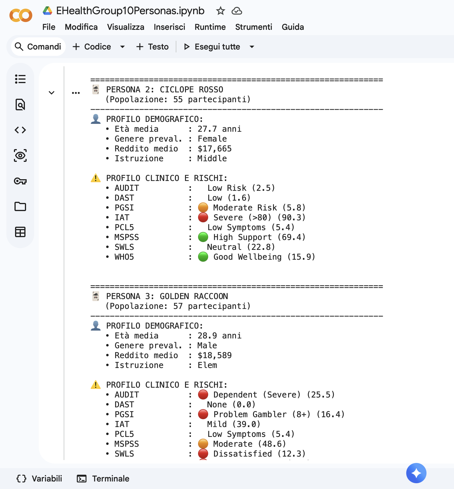

# Personas Analysis

This folder contains the questionnaire-based persona analysis developed to support the user-centered design of the 2D serious game on addiction awareness.

The analysis uses an eHealth questionnaire dataset to identify representative user profiles through feature engineering, preprocessing, dimensionality reduction, clustering, validation metrics, and persona interpretation. The resulting personas were used to inform design decisions related to addiction-related mechanics, educational framing, difficulty balancing, visual feedback, and content adaptation.

## Folder content

```text
personas_analysis/
├── EHealthGroup10Personas.ipynb
├── questionnaire_codebook_eHealth20252026.xlsx
└── README.md
```

The dataset required to run the notebook is intentionally not included in the public repository.

Expected local dataset filename:

```text
dataset_project_eHealth20252026.csv
```

The notebook expects the dataset and the codebook to be available with the following filenames:

```python
dataset_filename = "dataset_project_eHealth20252026.csv"
codebook_filename = "questionnaire_codebook_eHealth20252026.xlsx"
```

## Data availability

The dataset is excluded from the repository because it may contain sensitive questionnaire data related to addiction, well-being, psychological symptoms, and social support.

To reproduce the analysis locally or in Google Colab, place the dataset in the same folder as the notebook, or upload it when prompted by the notebook.

The codebook is included because it only describes the questionnaire variables, response types, column names, and codification options.

## Technical overview

The notebook follows a structured analysis pipeline:

1. **Data loading**
   - Loads the questionnaire dataset from CSV.
   - Loads the questionnaire codebook from Excel.
   - Uses the codebook to associate variables with questionnaire groups.

2. **Codebook-based variable grouping**
   - Socioeconomic variables: age, gender, education, marital status, income.
   - Addiction-related scales:
     - AUDIT: alcohol use.
     - DAST: drug use.
     - PGSI: gambling behavior.
     - IAT: internet use.
   - Psychological and well-being scales:
     - PCL-5: PTSD-related symptoms.
     - MSPSS: perceived social support.
     - SWLS: satisfaction with life.
     - WHO-5: well-being.

3. **Feature engineering**
   - Aggregates questionnaire items into total scale scores.
   - Builds a compact feature matrix combining demographic variables and psychometric scores.
   - Produces addiction-related, support-related, and well-being-related indicators.

4. **Preprocessing**
   - Handles missing values.
   - Detects and manages outliers.
   - Standardizes numerical variables.
   - Encodes categorical variables when required.
   - Prepares both numerical and mixed-type feature representations.

5. **Dimensionality reduction**
   - Uses PCA for numerical feature spaces.
   - Tests mixed-data representations when needed.
   - Evaluates the number of components through explained variance and scree plot analysis.

6. **Clustering**
   - Compares different clustering strategies and feature representations.
   - Includes methods such as K-Means, K-Medoids, Agglomerative Clustering, and distance-based clustering.
   - Uses validation metrics to compare alternative solutions.
   - Selects a final clustering solution with four representative personas.

7. **Cluster validation and interpretation**
   - Uses internal validation metrics such as silhouette score.
   - Applies statistical comparisons across clusters, including non-parametric tests for numerical variables and contingency-based tests for categorical variables.
   - Interprets clusters according to demographic characteristics, addiction scores, psychological indicators, social support, and well-being.

8. **Persona generation**
   - Converts the final clusters into interpretable persona profiles.
   - Assigns representative names and descriptive characteristics.
   - Summarizes each persona using demographic information, clinical-style score labels, and addiction-related risk patterns.

## Main Python libraries

The notebook mainly uses:

```text
numpy
pandas
matplotlib
seaborn
scikit-learn
scipy
statsmodels
prince
gower
pyclustering
sklearn-extra
```

Some libraries may need to be installed manually depending on the environment. The notebook includes installation attempts for selected optional packages when running in Google Colab.

## Analysis outputs

The notebook can generate local output files such as:

```text
persona_table_eHealth2025.xlsx
dataset_with_clusters_eHealth2025.csv
persona_cards_summary.xlsx
Persona_Summary_Table.xlsx
```

These generated files are not required to be committed to the repository. If produced locally, they should be treated as analysis outputs and kept out of version control unless they are anonymized and intentionally shared.

## Visual outputs

The following figures summarize some of the analysis outputs used to support the persona-based design process.

### Correlation analysis

This figure summarizes relationships between questionnaire-derived scores and helps identify relevant patterns between addiction-related variables, well-being, and support-related indicators.

<p align="center">
  
</p>

### Dimensionality reduction and clustering exploration

This output shows the use of dimensionality reduction and clustering exploration to support the selection of an appropriate persona structure.

<p align="center">
  
</p>

### Clustering validation

This figure summarizes clustering validation metrics used to compare alternative clustering solutions.

<p align="center">
  
</p>

### Final persona profiles

This output summarizes the final persona profiles obtained from the selected clustering solution.

<p align="center">
  
</p>

## Role in the serious game design

The persona analysis was used as a design-support step rather than as a standalone clinical assessment.

Its purpose was to connect questionnaire-based user profiles with game design choices, including:

- definition of representative player profiles;
- characterization of different addiction-related risk patterns;
- adaptation of educational messages to different user needs;
- support for mechanics related to awareness, decision-making, impulse control, and consequences;
- justification of user-centered design decisions within the serious game project.

## Notes

This analysis was developed for academic and educational purposes within an eHealth serious game project.

The results should be interpreted as design-oriented user personas, not as diagnostic classifications.

If the dataset is shared in the future, it should only be included if it is fully anonymized and if public redistribution is explicitly allowed.
